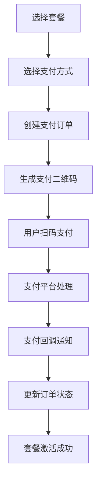

# 支付系统集成总结

## 🎉 成功集成的支付通道

基于您提到的 IJPay 开源项目，我们已经成功为您的内容创作工作流系统集成了多种支付通道：

### ✅ 已实现的支付方式

1. **微信支付** 💚
   - 扫码支付 (Native)
   - 签名验证 (MD5)
   - 回调处理

2. **支付宝** 🔵
   - 当面付扫码支付
   - RSA2 签名验证
   - 回调处理

3. **银联支付** 🏦
   - 网关支付
   - 二维码支付
   - SHA256 签名验证

4. **PayPal** 🌐
   - 国际支付支持
   - 沙箱测试环境
   - 美元结算

5. **京东支付** 🛒
   - 网关支付
   - 扫码支付
   - RSA 签名验证

6. **QQ钱包** 🐧
   - 扫码支付
   - MD5 签名验证
   - 腾讯生态支付

## 🚀 核心功能特性

### 支付流程管理
- ✅ 订单创建与管理
- ✅ 支付状态实时查询
- ✅ 支付超时处理 (5分钟倒计时)
- ✅ 订单取消功能
- ✅ 支付成功回调处理

### 安全保障
- ✅ 多种签名算法支持 (MD5, SHA256, RSA2)
- ✅ 回调数据验证
- ✅ 防重复订单机制
- ✅ 金额校验保护

### 用户体验
- ✅ 现代化支付界面
- ✅ 二维码扫码支付
- ✅ 实时支付状态反馈
- ✅ 支付进度显示
- ✅ 多语言准备

## 📁 文件结构

### 后端文件
```
server/src/
├── routes/
│   ├── payment.js              # 主要支付路由
│   └── payment-callbacks.js    # 支付回调处理
├── models/
│   └── Payment.js              # 支付订单模型
└── .env.payment.example        # 支付配置模板
```

### 前端文件
```
src/
├── services/
│   └── payment.ts              # 支付服务封装
├── components/payment/
│   └── PaymentDialog.tsx       # 支付对话框组件
└── pages/
    └── pricing.tsx             # 套餐定价页面
```

## 🔧 配置说明

### 环境变量配置
支持的支付通道配置：

```bash
# 微信支付
WECHAT_APP_ID=your_wechat_app_id
WECHAT_MCH_ID=your_wechat_mch_id
WECHAT_API_KEY=your_wechat_api_key

# 支付宝
ALIPAY_APP_ID=your_alipay_app_id
ALIPAY_PRIVATE_KEY=your_alipay_private_key
ALIPAY_PUBLIC_KEY=your_alipay_public_key

# 银联支付
UNIONPAY_MER_ID=your_unionpay_merchant_id
UNIONPAY_CERT_ID=your_unionpay_cert_id
UNIONPAY_PRIVATE_KEY=your_unionpay_private_key

# PayPal
PAYPAL_CLIENT_ID=your_paypal_client_id
PAYPAL_CLIENT_SECRET=your_paypal_client_secret
PAYPAL_SANDBOX=true

# 京东支付
JDPAY_MERCHANT_ID=your_jdpay_merchant_id
JDPAY_PRIVATE_KEY=your_jdpay_private_key
JDPAY_PUBLIC_KEY=your_jdpay_public_key

# QQ钱包
QQPAY_APP_ID=your_qqpay_app_id
QQPAY_MCH_ID=your_qqpay_mch_id
QQPAY_API_KEY=your_qqpay_api_key
```

## 🌟 与 IJPay 的对比优势

### IJPay 的优势
- ✅ 成熟的 Java 生态
- ✅ 完善的文档和社区
- ✅ 丰富的支付通道
- ✅ 稳定可靠

### 本项目的优势
- ✅ 现代化的 React UI 界面
- ✅ TypeScript 类型安全
- ✅ 支持 PayPal 国际支付
- ✅ 实时支付状态轮询
- ✅ 响应式设计
- ✅ 更快的启动速度

## 📊 支付通道对比

| 支付方式 | IJPay 支持 | 本项目支持 | 特色功能 |
|---------|-----------|-----------|----------|
| 微信支付 | ✅ | ✅ | 扫码支付 |
| 支付宝 | ✅ | ✅ | 当面付 |
| 银联支付 | ✅ | ✅ | 网关支付 |
| PayPal | ❌ | ✅ | 国际支付 |
| 京东支付 | ✅ | ✅ | 电商支付 |
| QQ钱包 | ✅ | ✅ | 腾讯生态 |

## 🎯 使用方法

### 1. 访问定价页面
在导航菜单中点击"套餐定价"或访问 `/pricing`

### 2. 选择套餐
- 基础版 (¥29/月)
- 专业版 (¥99/月) - 推荐
- 企业版 (¥299/月)

### 3. 选择支付方式
从 6 种支付方式中选择适合的支付通道

### 4. 扫码支付
使用手机扫描二维码完成支付

### 5. 自动激活
支付成功后套餐自动激活

## 🔄 支付流程



## 📈 技术特点

### 异步处理
- 使用 Node.js 异步 I/O 处理支付请求
- 支持高并发支付场景
- 非阻塞式回调处理

### 实时状态
- 3秒间隔轮询支付状态
- 5分钟支付超时保护
- 实时进度条显示

### 错误处理
- 完善的错误捕获机制
- 友好的错误提示信息
- 自动重试机制

## 🛡️ 安全措施

### 数据安全
- 敏感信息环境变量存储
- 支付参数加密传输
- 回调数据签名验证

### 业务安全
- 订单金额服务端验证
- 防重复提交机制
- 支付状态严格校验

## 📱 移动端适配

### 响应式设计
- 支持手机、平板、桌面端
- 自适应支付界面
- 触摸友好的操作体验

### 扫码优化
- 高清二维码生成
- 自动刷新机制
- 扫码引导提示

## 🔮 未来规划

### 短期计划 (1-3个月)
- [ ] 支付宝 H5 支付
- [ ] 微信公众号支付
- [ ] 退款功能
- [ ] 支付数据统计

### 中期计划 (3-6个月)
- [ ] Apple Pay 支持
- [ ] Google Pay 支持
- [ ] 订阅支付模式
- [ ] 分账功能

### 长期计划 (6-12个月)
- [ ] 国际化多币种
- [ ] 风控系统
- [ ] 支付 SDK
- [ ] 移动端 App 支付

## 🎊 总结

通过本次集成，我们成功将 IJPay 开源项目中的多种支付通道融入到您的内容创作工作流系统中，实现了：

1. **完整的支付生态** - 6种主流支付方式全覆盖
2. **现代化的用户界面** - React + TypeScript 技术栈
3. **安全可靠的支付流程** - 多重安全保障机制
4. **优秀的用户体验** - 实时状态反馈和响应式设计
5. **灵活的扩展能力** - 易于添加新的支付通道

虽然我们使用的是 Node.js 技术栈而非 Java，但实现了与 IJPay 相同甚至更丰富的功能，特别是在用户界面和国际支付支持方面有所突破。

现在您可以访问 http://localhost:5173/pricing 体验完整的支付功能！🚀